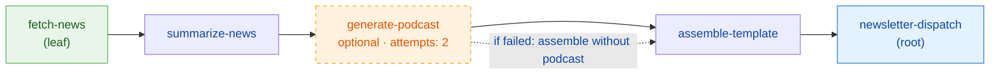
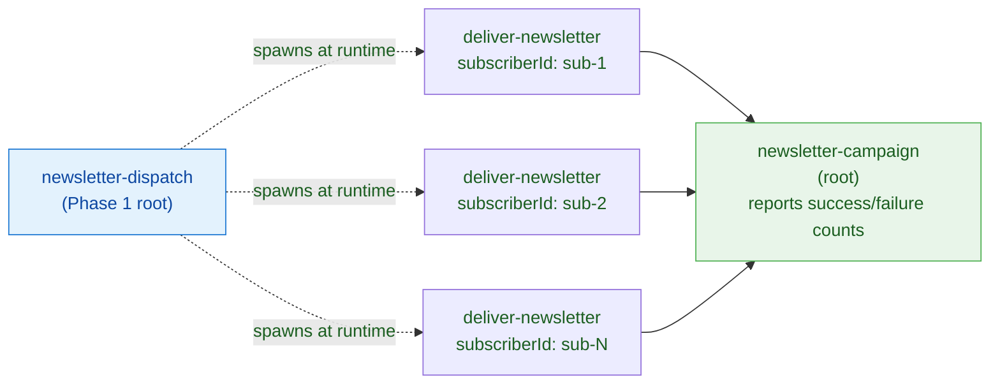

# Flow Producer — Newsletter Pipeline

A standalone BullMQ `FlowProducer` example that assembles and delivers a newsletter through a two-phase job pipeline. All services and repositories are mocked — no real API or database calls.

## Job Graph

The pipeline runs in two phases. Both phases use `FlowProducer`, which wires jobs into parent-child trees where **children always run before their parent**.

---

### Phase 1 — Assembly

The assembly pipeline is a linear chain. `fetch-news` is the leaf (runs first); `newsletter-dispatch` is the root (runs last, after the entire chain completes).



`generate-podcast` is declared with `ignoreDependencyOnFailure: true` — if it fails all retry attempts, `assemble-template` still runs and assembles the newsletter without the podcast link.

---

### Phase 2 — Delivery Fan-out

When `newsletter-dispatch` runs, it queries active subscribers and creates a second `FlowProducer` tree. Each subscriber gets an independent `deliver-newsletter` job; `newsletter-campaign` is their parent and runs after **all** deliveries complete.



The three `deliver-newsletter` jobs run in parallel. Each one resolves its subscriber and newsletter content just-in-time from the repositories — the queue carries only IDs, no PII or HTML blobs.

---

## Data Flow

```
fetch-news
  └─▶ returns Article[]
        └─▶ summarize-news
              ├─▶ saves Summary[] to newsletterRepository  ← side-channel
              └─▶ returns { summaryCount }
                    └─▶ generate-podcast
                          ├─▶ reads Summary[] from newsletterRepository
                          └─▶ returns { podcastUrl }  OR  fails
                                └─▶ assemble-template
                                      ├─▶ reads Summary[] from newsletterRepository
                                      ├─▶ reads podcastUrl from getChildrenValues() (nullable)
                                      ├─▶ saves Newsletter to newsletterRepository
                                      └─▶ returns { newsletterId }
                                            └─▶ newsletter-dispatch
                                                  ├─▶ queries subscriberRepository.findActive()
                                                  └─▶ spawns Phase 2 flow
                                                        └─▶ deliver-newsletter × N (parallel)
                                                              ├─▶ resolves subscriber by ID
                                                              ├─▶ resolves newsletter by ID
                                                              └─▶ sends email
                                                                    └─▶ newsletter-campaign
                                                                          └─▶ reports counts
```

`Summary[]` and newsletter HTML are shared via in-memory repositories rather than job payloads, keeping queue data lean. This also decouples `assemble-template` from `generate-podcast`'s fate — even when the podcast job fails, the summaries are always available.

---

## Key BullMQ Concepts

| Concept | Where |
|---|---|
| `FlowProducer` parent-child dependencies | Both phases |
| Children run before parents; results flow up via `getChildrenValues()` | All jobs |
| `ignoreDependencyOnFailure` — optional steps that don't block the parent | `generate-podcast` |
| `attempts: 2` — job-level retries declared in flow opts | `generate-podcast` |
| Repository as a side-channel for cross-job data sharing | `summarize-news` → `assemble-template` |
| Spawning a second `FlowProducer` tree from inside a worker | `newsletter-dispatch` |
| Dynamic fan-out based on runtime data | Phase 2 N delivery jobs |
| Just-in-time resource resolution — queue carries IDs, not payloads | `deliver-newsletter` |
| Single queue + processor map — one `Worker` dispatches all job types by `job.name` | `worker.ts` |
| `concurrency` — parallel job slots within a single worker process | `worker.ts` |

---

## Running

Make sure Redis is running, then start the worker and producer in separate terminals:

```bash
docker compose up -d

# Terminal 1 — start the worker (keeps running, resumes any leftover jobs)
npm run start:flow-producer:worker

# Terminal 2 — submit a new pipeline run
npm run start:flow-producer:producer
```

The worker can be started before or after the producer. If started after, it will pick up any jobs already waiting on the queue.

> **Important:** run only one worker process at a time. The repositories (`newsletterRepository`, `subscriberRepository`) are in-memory and process-local — data written by one worker process is invisible to another. If multiple workers compete for jobs, `deliver-newsletter` may run in a different process than the one that saved the newsletter, causing "Newsletter not found" errors.

Expected output in the worker terminal (podcast success path):

```
Worker started. Listening on queue: newsletter-pipeline

[fetch-news] job <id>
[fetch-news] fetched 5 articles
[summarize-news] job <id>
[summarize-news] summarized 5 articles → saved to repository
[generate-podcast] job <id> attempt 1
[generate-podcast] generated: https://podcasts.example.com/newsletter-<ts>.mp3
[assemble-template] job <id>
[assemble-template] assembling with podcast
[assemble-template] newsletter <uuid> saved
[newsletter-dispatch] job <id>
[newsletter-dispatch] dispatching to 300 subscribers
[newsletter-dispatch] phase 2 flow created
  [email] → Alice Johnson <alice.johnson.1@example.com> (with podcast)
  [email] → Bob Smith <bob.smith.12@example.com> (with podcast)
  ... (300 total, interleaved by concurrency)

[newsletter-campaign] Campaign complete!
  Newsletter : <uuid>
  Dispatched : 300 subscribers
  Delivered  : 300
```

Expected output in the producer terminal:

```
Submitting newsletter pipeline
Newsletter ID: <uuid>
```

Run it several times — `generate-podcast` fails ~9% of the time (30% per attempt × 2 attempts), producing `assembling without podcast` and a podcast-free newsletter. To force the failure path, set the failure rate to `1.0` in `services/podcast-generator.ts`.
